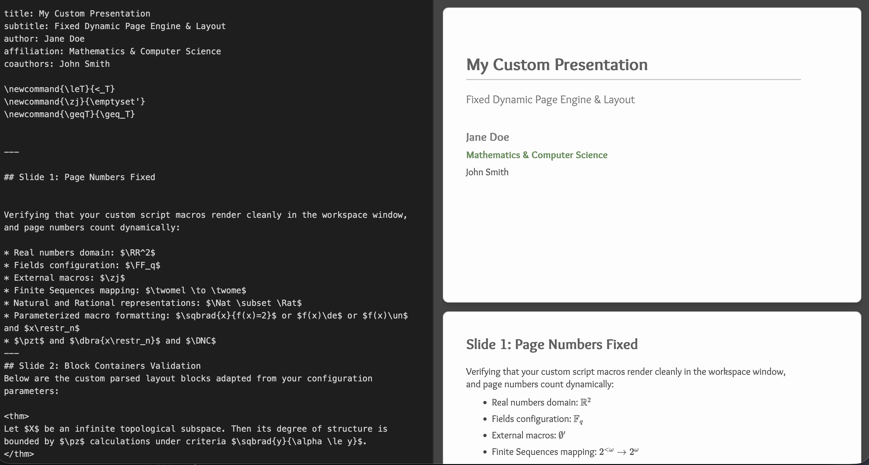

Markdown Live Editor that supports:

- Katex and custom latex macros
- html/Javascript imports (including dynamic content, animations etc.)
- colors and other font decorations with custom html tags
- image imports from local folders
- theorem environments and several side types (section separators, references, contents slidres etc.)

[Demo](http://barmpalias.net/share/md_slides/)

