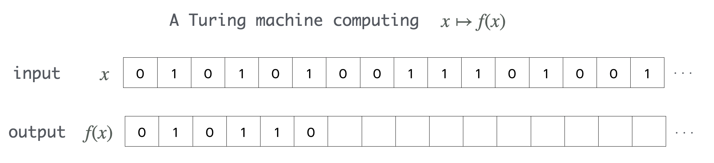
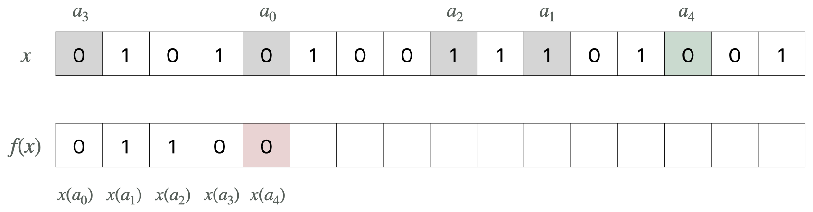
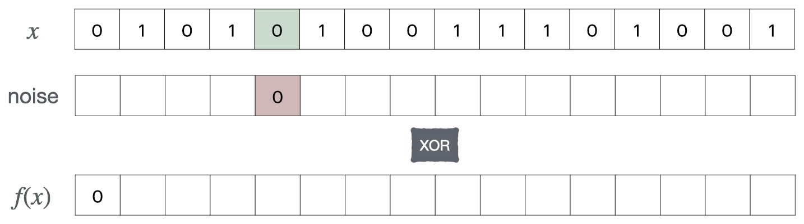
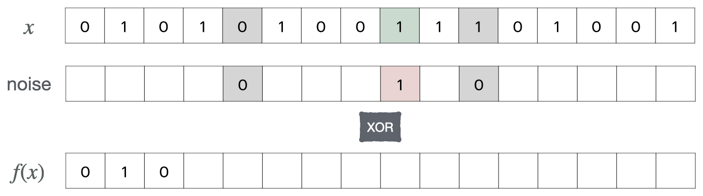
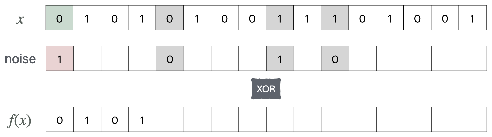
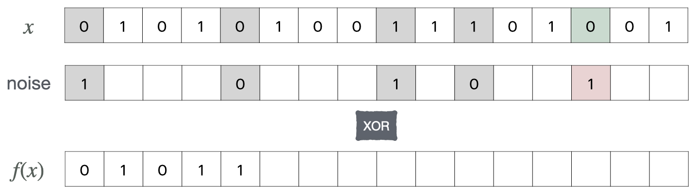

title: Computable oneway real functions 
subtitle: Hardness of inverting functions on the reals
author: George Barmpalias
affiliation: Chinese Academy of Sciences
coauthors: Joint work with M. Wang and X. Zhang
meeting: Tianyuan Workshop on Computability and Descriptive Set Theory, June 2025

\newcommand{\leT}{<_T}
\newcommand{\zj}{\emptyset'}
\newcommand{\geqT}{\geq_T}

---
frozen

## Effective functions on the reals

$\leT$

This is a standard notion in <g>computable analysis</g> due to Turing (1936).

<box>
Computability of real functions is <g>effective continuity</g>:

- computable real functions are continuous
- every continuous real function is computable in some oracle

</box>
	
---
center

### Overview (25 slides)

1. Inversions of real functions
2. Oneway real functions
3. Nearly injective functions
3. Collisions and hashing
4. Weakly oneway 
6. Unresolved problems

---

## Partial computable real functions

<box>

- Continuous with $\Pi^0_2$ domain and $\Sigma^1_1$ range 
- if total then *uniformly* continuous with $\Pi^0_1$ range

</box>

Properties of interest include many-to-one versus one-to-one and

- **Positive:** they map a positive set to a positive set of reals
- **Random-preserving:** they map randoms to randoms 

<propc>
A partial computable function is positive iff
it extends a random-preserving partial computable function.
</propc>

Positive and random-preserving maps can be treated as one.

---

## Complexity of inversion

There is no degree bound, even for total functions.

<thm>
There is a total computable random-preserving surjection $f$
which has no continuous inversion.
</thm>

Total computable *injections* have computable inverses.

<propc>
If a total computable $f$ is injective on $R$ then $f:R\to 2^{\omega}$ is effectively invertible.
</propc>

Inversion-hardness from <r>non-injectivity</r> and <r>partiality</r> (domain complexity).

---

## Using domain complexity

The true sentences of arithmetic form a $\Pi^0_2$ singleton: $\{\emptyset^{\omega}\}\in \Pi^0_2$.

<propc>
There are partial computable $f, h:\subseteq\twome\to\twome$ such that

- $f$ is injective and no arithmetical $g$ can invert $f$ on any real
- $\dom(h)$ is uncountable and no $g\in \Delta^1_1$ can invert $h$ on any real.
	
</propc>

Many other examples using facts from computability:

- positive domain and/or range
- random outputs or even random-preserving

for example $x\oplus z\mapsto x$ restricted to randoms.

---

## Randomized computations

Randomized computations can occasionally be replaced by deterministic ones.

---
frozen

## Probabilistic inversion 

Given  $f, g:\subseteq 2^{\omega}\to 2^{\omega}$ we say that $g$ is a

- **positive** inversion of $f$ if $\hspace{0.1cm}\mu(\sqbrad{y}{f(g(y))=y})>0$

- **probabilistic** inversion of $f$ if $\hspace{0.1cm}\mu(\sqbrad{y\oplus r}{f(g(y\oplus r))=y})>0$

<exc>
There is an effective positive $f$ which is probabilistically invertible but has no positive inversion $\leq_T 0'$.
</exc>

Restrict $x\oplus z\mapsto z$ to a $\Pi^0_1(0')$ class of 2-randoms

<propc>
The following are equivalent:

- for positive many $r$ there is a positive inversion $g\leq_T r$ of $f$
- there is a probabilistic inversion $g\leq_T\emptyset$ of $f$.

</propc>

---

## Examples

<propc>
There is a partial computable $f:\subseteq\twome\to\twome$  which is 

- random-preserving and nowhere effectively invertible 
- a.e. probabilistically invertible.

</propc>

<thm>
If $f$ is a positive partial computable function then it has a positive inversion $g\leq_T 0''$. If $f$ is total then $g\leq_T 0'$.

</thm>

<questc>
What is the complexity of 
probabilistic inversions of positive partial computable functions?
</questc>

--
--

---
center

## Oneway real functions

---

## Oneway functions

In computational complexity they are finite maps between <r> strings</r> that are 

<box> 
easy to compute but hard to invert, even probabilistically 
</box>

Levin (2023) extended them to <r>real</r> functions:

<box> 
partial computable, positive, with no effective probabilistic inversion.
</box>

and <gb>asked if they exist</gb>. Last year (2024)

- Gacs constructed one, except that it was not positive
- We came up with a total random-preserving oneway surjection.

<g>Properties of interest:</g> total, surjective, injective, collision-resistant.

---

## Shuffle maps on the reals

A <g>shuffle</g> $f:\twome\to\twome$ is given by a computable injection $(a_i)\in\omega^{\omega}$  and
$$
f(x)(i):=x(a_i).
$$

---
frozen

## Shuffle maps on the reals

A <g>shuffle</g> $f:\twome\to\twome$ is given by a computable injection $(a_i)\in\omega^{\omega}$  and
$$
f(x)(i):=x(a_i).
$$

---
frozen

## Shuffle maps on the reals

A <g>shuffle</g> $f:\twome\to\twome$ is given by a computable injection $(a_i)\in\omega^{\omega}$  and
$$
f(x)(i):=x(a_i).
$$

---
frozen

## Shuffle maps on the reals

A <g>shuffle</g> $f:\twome\to\twome$ is given by a computable injection $(a_i)\in\omega^{\omega}$  and
$$
f(x)(i):=x(a_i).
$$

---
frozen

## Shuffle maps on the reals

A <g>shuffle</g> $f:\twome\to\twome$ is given by a computable injection $(a_i)\in\omega^{\omega}$  and
$$
f(x)(i):=x(a_i).
$$

---
frozen

## Shuffle maps on the reals

A <g>shuffle</g> $f:\twome\to\twome$ is given by a computable injection $(a_i)\in\omega^{\omega}$  and
$$
f(x)(i):=x(a_i).
$$

<factc> 
The $(a_i)$-shuffle has the following properties: 

- it is a total computable random-preserving surjection
- it is strongly nowhere injective: $f^{-1}(y)$ is uncountable for each $y$
- every probabilistic inversion of it computes $\sqbrad{a_i}{i\in\omega}$.

</factc>

Letting $(a_i)$ be an injective enumeration of $0'$ we get:

<thmc>
There is a total computable random-preserving oneway surjection $f$ such that any probabilistic inversion of $f$ computes $0'$.
</thmc>

---

## Why shuffles are oneway

Shuffles $f$ are <g>nowhere injective</g> so an inversion $g$ of $f$

<box>
	
- <r>makes choices</r> on the unused bits
- the set of unused bits is <g>undecidable</g>.

</box>
	
Therefore if $g$ attempts to effectively invert $f$: 

<box>
	
- input-bits determined by $g$ are <r>later appended</r> in the output
- this makes the output <g>predictable</g> by  $g$
- almost all outputs are unpredictable (random)

</box>

So $g$ fails to invert $f$ almost everywhere.

---

## Variations on shuffles

If $(a^z_i)$ is the $z$-computable enumeration of $z'$ and $h^z(x)$ is given by
$$
h^z(x)(i):=x(a^z_i)
$$
the <gb>relativized shuffle</gb> $f:\twome\to\twome$ is  be given by 
$$f(x\oplus z):=h^z(x)\oplus z.$$

<factc> 
The relativized shuffle

- is a total computable random-preserving surjection
- is oneway and has <r>no continuous inversion</r>
- has a positive inversion $g\leq_T 0'$

</factc>

and is strongly nowhere injective: $f^{-1}(y)$ is uncountable for each $y$.

---

## Variations on shuffles

<thm>
For each c.e. $A$ there is a total computable function which 

- is random-preserving and surjective
- has an <g>$A$-computable</g> inversion
- is <r>not</r> probabilistically invertible on any random $y\not\geq_T A$
- is oneway relative to <r>any</r> $w\not\geq_T A$.

</thm>

Injective oneway functions require partiality:

<propc>
Every total computable random-preserving oneway function is almost nowhere injective: $f^{-1}(f(x))$ is perfect for almost all $x$.
</propc>

--
--

---
center

## Nearly injective functions

---

We say that $f:\twome\to\twome$ is <g>two-to-one</g> if $\forall y,\ \abs{f\inv(y)}\leq 2$.

<thmc>
There is a total computable  $f:\twome\to\twome$ such that:

- $f$ is a two-to-one random-preserving surjection
- $f$ is almost everywhere effectively invertible
- every $g:\subseteq\twome\to\twome$ that inverts $f$  computes $0'$

and the latter  holds for the restriction of $f$ in any cylinder $\dbra{\sigma}$.

</thmc>
 
 
<box>
The form is $f(x\oplus z):=h^z(x)\oplus z$ where

- $h^z$ selects positions of $x$-bits <g>used</g> in (copied into) $h^z(x)$ 
- all but at most one position $k^z$ are <g>used</g> in $h^z(x)$.

</box>

---

## Blueprint for two-to-one functions

<box>

- if $\lim_s k^z_s=\infty$   all $x$-positions are used in $h^z(x)$ 
- if $\lim_s k^z_s=k^z$  all $x$-positions <g>except $k^z$</g>   are used in $h^z(x)$.

</box>

<box>
Given $E^z_s\in \Sigma^0_1$  we update the unused $k^z_s$ if

- either $k^z_s\in \zj_s$ which we call a <g>$\zj$-permission</g>
- or $E^z_s(k^z_s)$ which we call a <g>$z$-permission</g>

</box>

<r>Goal:</r> given inversion $g$, for each $n$ produce $z,s$ with $k^z_s=n$ and $\neg E^z_s(k^z_s)$.

---

<thmc>
There is a total computable  $f:\twome\to\twome$ such that:

- $f$ is a two-to-one random-preserving surjection
- every $g:\subseteq\twome\to\twome$ that inverts $f$  computes $0'$

</thmc>

Let $f(x\oplus z):=h^z(x)\oplus z$ and 

$$
k^z_{s+1}:=\begin{cases}
s+1 &  \textrm{if $k^z_{s}\in \zj_{s}$ or $z(\tuple{k^z_{s},s})=1$} \\\\
k^z_{s} &  \textrm{otherwise.}
\end{cases}
$$

To select the next $x$-bit used in $f(x\oplus z)$ let $h^z(x; s):=x(p^z_s)$ where:

$$
p^z_s:=\begin{cases}
s+1 &  \textrm{if $k^z_{s+1}=k^z_{s}$} \\\\
k^z_{s} &  \textrm{otherwise.}
\end{cases}
$$

<box>
Given inversion $g$, for each $n$ produce $z,s$ with $k^z_s=n$ and $\neg E^z_s(k^z_s)$.

Use $g(f(0^\omega\oplus z))$ to determine if $n\in \zj$.
</box>

---

<thmc>
There is a total computable  $f:\twome\to\twome$ with:

- $f$ is a two-to-one random-preserving surjection 
- for each partial $g\not\geq_T \zj$, with positive probability, $g$ fails to invert $f$

and the latter  holds for the restriction of $f$ in any cylinder $\sigma$.

</thmc>

- $f(x\oplus z):=h^z(x)\oplus z$ and $h^z(x; s):=x(p^z_s)$ 
- <r>Issue</r>: inversions can only be assumed almost total.
- <r>Solution</r>: work with incomplete randoms.

<box>
Let $z^n$ be the $n$th column of $z$ and $U$ a member of a universal test.
</box>

---

Given $z$ let  $k^z_s$ be the non-decreasing <g>counter</g> with  
$$
k^z_{s+1}:=\begin{cases}
s+1 &  \textrm{if $d^z_{s}\in \zj_{s}$ or $z^{d^z_{s}}\in U_s$} \\\\
\ \ k^z_{s} &  \textrm{otherwise}
\end{cases}
$$
where $d^z_{s}:=\abs{\sqbrad{t<s}{k^z_{t+1}\neq k^z_{t}}}$ counts the updates of $k^z$ and
$$
p^z_s:=\begin{cases}
s+1 &  \textrm{if $k^z_{s+1}=k^z_{s}$} \\\\
\ \ k^z_{s} &  \textrm{otherwise}
\end{cases}
$$
Updates of  $k^z$ coincide with those of $d^z$ and are due to one of:

-  $d^z_{s}\in \zj_{s}$ which we call  <g> $\zj$-permission</g> of $k^z_{s}$ at $s+1$
-  $z^{d^z_{s}}\in U_s$ which we call  <g> $z$-permission</g> of $k^z_{s}$ at $s+1$.

---

<thmc>
There is a total computable  $f:\twome\to\twome$ with:

- $f$ is a two-to-one random-preserving surjection 
- for each partial $g\not\geq_T \zj$, with positive probability, $g$ fails to invert $f$

</thmc>

For each $r\not\geqT\zj$ there exist $y, w$ such that 

- $y\oplus  w$ is weakly $r$-random and $y$ is  random 
- no column $w^n$ of $w$ is  random and $r\oplus y\oplus  w\not\geqT\zj$.

Effectively in $y\oplus w$ and  $n$ we can  define $z$ and  $s$ such that

-  $d^z_{s}=n$ and  $(\lim_t k^z_t<\infty \iff \lim_t k^z_t=k^z_s \iff n\not\in\zj)$
-  $y\oplus z$ is weakly $r$-random.

<box>
Given a.e. inversion $g$, use $g(f(x\oplus z))$ to determine if $n\in \zj$.
</box>

--
--

---
center

## Weakly oneway functions

---
	
## Left and right oneway functions (Gacs)

<defi>
A partial computable $f$ is <r>left-oneway</r> if  it has <gb>positive domain</gb> and 
$$\mu(\sqbrad{x\oplus r}{f(g(f(x), r))=f(x)})=0$$ for each partial computable $g$.
It is <r>right-oneway</r> if  $$\mu(\{y\oplus r:f(g(y\oplus r))=y\})=0$$
for each partial computable $g$ and it has <gb>positive range</gb>. 
</defi>

These notions are considerably weaker than oneway functions.

<box>
Gacs (2024) showed that there is a left-oneway partial computable $f$.
</box>

---

## Another way...

<box>
	
By Kurtz <r>every 2-random $x$ is CEA</r> (it is $y$-c.e. for some $y \leT x$).

- if $x\leq_T r \oplus y$ and $x$ is $y$-c.e. then r is not y'-random
- there are only countably many y-c.e. sets

so the functional $\Phi(x)=y$ of Kurtz is left-oneway.

</box>

Can the above be injective?

<questc>
Is there a partial computable injection that maps to 1-generics with positive probability?
</questc>

---

## Oneway injections

<questc>
Is there an injective oneway real function? 
</questc>

All constructions of oneway real functions rely on non-injectivity.

<box>

We know that oneway injections are:

- partial: their domain does not contain any positive $\pz$ class
- not oneway relative to any almost everywhere dominating oracle.

</box>

By a direct measure-type priority construction we show:

<thmc>
There is a left-oneway partial computable injection.
</thmc>

---
center

## Collisions and hashing

---

## Collision resistance

$\CC\subseteq\twome$ is <g>negligible</g>
if the  set of oracles that compute a member of $\CC$ is null.

<defi>
We say that $f:\subseteq \twome\to\twome$ is <g>collision-resistant</g> if
$$S_f:=\sqbrad{(x,z)}{x\neq z\wedge f(x)=f(z)}$$
is negligible. The members of $S_f$ are called <gb>$f$-siblings</gb>. 
</defi>

Levin (2024) noticed that shuffles

- can be made <gb>weakly</gb> collision-resistant
- <rb>cannot</rb> be made collision-resistant.

and asked for a collision-resistant computable oneway real function.

---

## Hashing the shuffles

The idea is to XOR the shuffle output with "random" bits.

<defic>
A <gb>hash-shuffle</gb> $f:\twome\to\twome$ is given by
$$
f(x)(i):=x(a_i)\otimes \texttt{noise}(i)
$$
where $(a_i)$ is a computable enumeration  of $A$ without repetitions.
</defic>

---
frozen

## Hashing the shuffles

The idea is to XOR the shuffle output with "random" bits.

<defic>
A <gb>hash-shuffle</gb> $f:\twome\to\twome$ is given by
$$
f(x)(i):=x(a_i)\otimes  \texttt{noise}(i)
$$
where $(a_i)$ is a computable enumeration  of $A$ without repetitions.
</defic>

---
frozen

## Hashing the shuffles

The idea is to XOR the shuffle output with "random" bits.

<defic>
A <gb>hash-shuffle</gb> $f:\twome\to\twome$ is given by
$$
f(x)(i):=x(a_i)\otimes  \texttt{noise}(i)
$$
where $(a_i)$ is a computable enumeration  of $A$ without repetitions.
</defic>

---
frozen

## Hashing the shuffles

The idea is to XOR the shuffle output with "random" bits.

<defic>
A <gb>hash-shuffle</gb> $f:\twome\to\twome$ is given by
$$
f(x)(i):=x(a_i)\otimes  \texttt{noise}(i)
$$
where $(a_i)$ is a computable enumeration  of $A$ without repetitions.
</defic>

---
frozen

## Hashing the shuffles

The idea is to XOR the shuffle output with "random" bits.

<defic>
A <gb>hash-shuffle</gb> $f:\twome\to\twome$ is given by
$$
f(x)(i):=x(a_i)\otimes  \texttt{noise}(i)
$$
where $(a_i)$ is a computable enumeration  of $A$ without repetitions.
</defic>

---
frozen

## Hashing the shuffles

The idea is to XOR the shuffle output with "random" bits.

<defic>
If $A\subseteq\Nat$ is an infinite c.e. set a computable 
$$h: \sqbrad{\sigma}{|\sigma|\in A}\to \{0,1\}$$
is called an <gb>$A$-hash</gb> or simply a <gb>hash</gb>.
</defic>	

Let $\otimes$ denote XOR. We define <gb>hash-shuffles</gb>. 

<defic>
The <gb>$(h,A)$-shuffle</gb> $f:\twome\to\twome$ is given by
$$
f(x)(i):=x(a_i)\otimes h(x\restr_{a_i})
$$
where $(a_i)$ is a computable enumeration  of $A$ without repetitions.
</defic>

---

## Hash-shuffles

Let $A$ be a c.e. set and $h$ be an $A$-hash.

<prop> 
The $(h,A)$-shuffle is total computable and

- random-preserving and surjective
- nowhere injective: $f^{-1}(y)$ is uncountable for each $y$.
- oneway relative to all $w\not\geq_T A$.

</prop>

But how should we choose $h$ to make $f$ <gb>collision-resistant?</gb>

<box>
Let $h$ be the universal partial computable binary predicate $\varphi_i(i)$.
</box>

---

## Universal hashing

Let $A:=\sqbrad{\tuple{\sigma_i, n_i}}{i\in\Nat}$  where

- $(\sigma_i, n_i)$ is an effective enumeration of $\twomel\times \emptyset'$ and 
- $(\sigma,n)\mapsto\tuple{\sigma,n}$ is an effective bijection between $\twomel\times \emptyset'$, $\Nat$

and define the <gb>$A$-hash</gb>: 

$$
h(\tau):= 
\begin{cases}
\varphi_{n_i}(n_i)&\textrm{if $\sigma_i\prec \tau\wedge \tau\in 2^{\tuple{\sigma_i, n_i}}$}\\\\
\ \ \ 0 &\textrm{if $\sigma_i\not\prec \tau\wedge \tau\in 2^{\tuple{\sigma_i, n_i}}$}
\end{cases}
$$

so the <gb>$h$-shuffle</gb>  is given by $f(x)(i)=:h(x\restr_{\tuple{\sigma_i, n_i}})\otimes x(\tuple{\sigma_i, n_i})$.

<thmc>
There is a total computable function which is 

- random-preserving and surjective
- oneway and collision-resistant.

</thmc>

--
--

---
center

## Unresolved problems

---

## Oracles for inversion

We know that $\mathbf{0}'$ characterizes the strength of total oneway functions.

<questc>
Which oracles $x$ can probabilistically invert every

1. random-preserving partial computable <r>function $f$</r>?
2. random-preserving partial computable <r>injection $f$</r>?

</questc>

- for (1) $x\geq_T \emptyset''$ is sufficient and $x\geq_T \emptyset'$ is necessary
- for (2) computing an almost everywhere dominating $(m_i)$ is suffices. 

<questc>
Is there a partial computable oneway injection?
</questc>

---

## Making positive maps injective

<quest>
Which oracles $x$ can compute an injective restriction for each
random-preserving partial computable function?
</quest>

We know that $\mathbf{0'}$ suffices.

<thm>
If $f$ is partial computable and random-preserving there is $h$ which 

- is an injective restriction of $f$ and $h\leq_T \mathbf{0}'$ 
- has $\Pi^0_1(\emptyset'')$ domain and positive $\Pi^0_1(\emptyset'')$ range.

</thm>

--
--

---
thanks

## Thank you for your attention!

<xthanks>Thanks to Leonid Levin and Yu Liang and his students</xthanks>

<pur>References</pur>

- Zermelo-Fraenkel Axioms, Internal Classes, External Sets - Levin <ref>ArXiv 2209.07497</ref> 
- Computable one-way functions on the reals - <ref>Arxiv 2406.15817</ref>
- Complexity of inversion of functions on the reals - <ref>Arxiv 2412.07592</ref>
- Collision-resistant hash-shuffles on the reals  -  <ref>Arxiv 2501.02604</ref>
